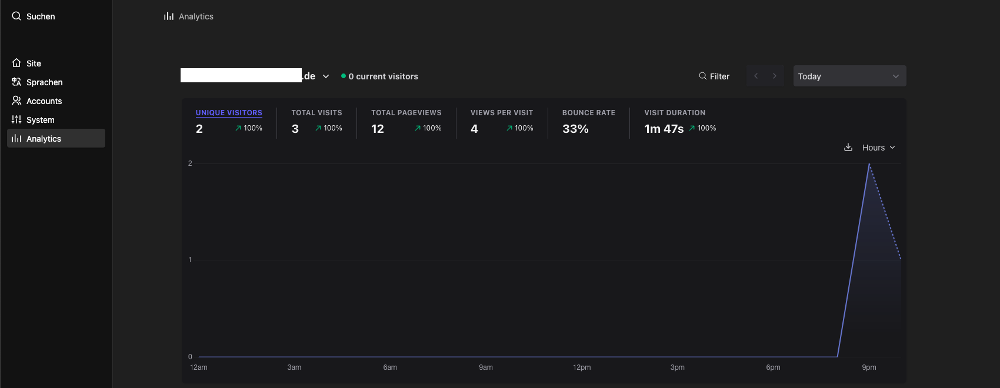

# Kirby Plausible plugin

Simple Kirby plugin that

* embeds **Plausible Analytics** in the Kirby Panel via an iframe (shared link)
* adds a **frontend snippet** tracking page views



---

## Commercial Usage

This plugin is free. If you use it in a commercial project, please consider:

* [making a donation](https://www.paypal.me/schnti/5)

---

## Installation

Via Composer:

```bash
composer require schnti/plausible
```

Or download the plugin from the GitHub releases and place it in:

```
/site/plugins/plausible
```

---

## Configuration

Add the following to your `config/config.php`:

```php
'schnti.plausible' => [
  // Required: Shared link for the Panel iframe view
  'sharedLink' => 'https://stats.example.com/share/example.com?auth=XXXXXXXX',

  // Required: Plausible tracking script (signed pa-*.js)
  // This can be plausible.io or a self‑hosted instance
  'script' => 'https://stats.example.com/js/pa-XXXXXXXX.js',
],
```

### Notes

* The `script` value should point to the **project‑specific (signed) Plausible script** (`pa-*.js`).
* The plugin assumes Plausible v2+ behavior.

## Frontend usage

Add the snippet inside your site’s `<head>` section:

```php
<?php snippet('plausible'); ?>
```

### Behavior

The snippet outputs **nothing** when:
  * Kirby is in `debug` mode
  * a user is logged into the Panel


## Panel Analytics View

The plugin adds a new **Analytics** entry to the Kirby Panel sidebar.

* Displays Plausible stats via the configured `sharedLink`
* Uses an iframe embed
* Implemented using `render()` (no runtime template compilation)
* Does **not** require `unsafe-eval`

> The Panel view is for visualization only and does **not** track page views.

## Content Security Policy (CSP)

A minimal CSP setup for a self‑hosted Plausible instance might look like this:

```txt
script-src 'self' `unsafe-inline` https://stats.example.com;
connect-src https://stats.example.com;
frame-src https://stats.example.com;
```

No `unsafe-eval` is required.

## Thanks

This plugin is based on the original work by [Florian Karsten](https://github.com/floriankarsten/kirby-plausible), many thanks for creating and sharing the foundation for this plugin 🙏